# MovieHub

### Website Demo
[Click HERE & Check Out Our DEMO](http://127.0.0.1:8080)

### What is MovieHub?
MovieHub is a mobile-ready, offline-storage, JS powered HTML5 edited movie rating, data analysis and recommendation system.

### What does MovieHub do?
* Support wildcard search and display over 3,700 movies' details, including:
  - Movie Name, Genre, Publish Year
  - Poster, Video Preview
  - Director(s), Actor(s)
  - Average Rating, etc.
* Support recommendations of:
  - TOP 10 best unseen movies for every different user and:
  - TOP 10 similar unseen similar movies for every specified movie that the user is checking on
* Support tracing each user's watching and rating history
  
### Where does our dataset come from?
We fetched the “MovieLens 1M Dataset” which was released in February 2003 from 
[This Website](https://grouplens.org/datasets/movielens/)
* It generally contains 1 million ratings from 6,000 users on 4,000 movies, in the format of CSV.
* For the data of user rating, this dataset includes mainly: User, Rating and Movie.
* For the data of user info, this data set includes mainly: User, Gender, Age, Zip-code.
 

We have also crawled
[IMDB](https://www.imdb.com)
to get  detail info about movies in the dataset mentioned above for better user experience. 
A preview of what's the data looks like is shown below 

  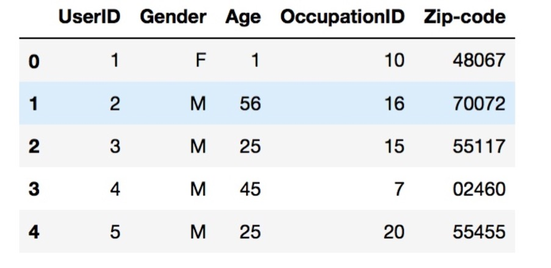 
  <h6 align="center">User Dataset</h6> 

 

   
  <h6 align="center">User Dataset</h6> 

 

  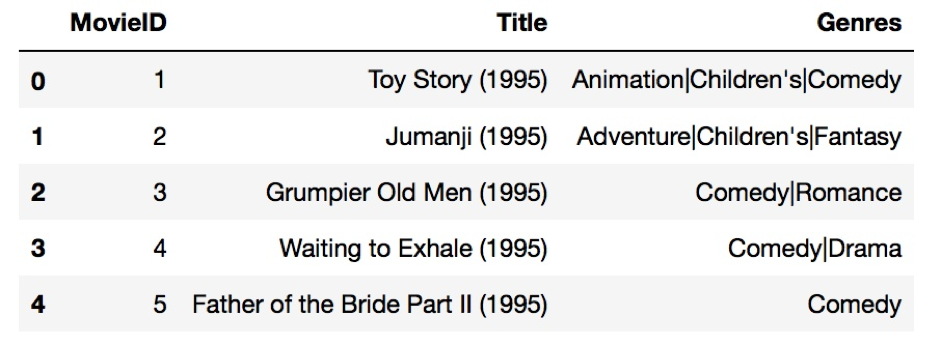 
  <h6 align="center">Movie Dataset</h6> 

 

  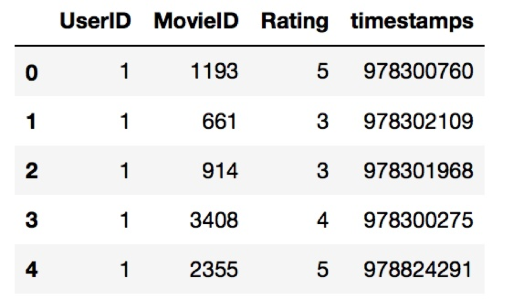 
  <h6 align="center">Rating Dataset</h6> 

 

### Algorithms
We have implemented three recommend algorithms in this project:
  - User based collaborate filtering
  - Item based collaborate filtering
  - SVD (Singular Value Decomposition)
  - Word2Vec and CNN sentiment analysis

 
Concepts are shown below as graphs:<br\>

  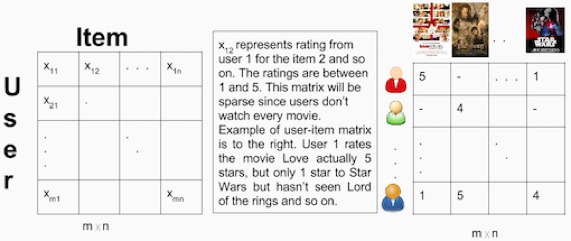 
  <h6 align="center">Collaborative Filtering</h6> 

 

  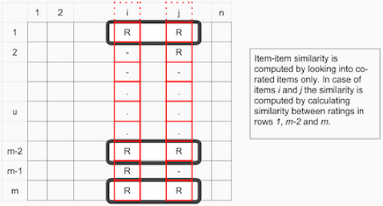 
  <h6 align="center">Item-Based Collaborative Filtering</h6> 

 

  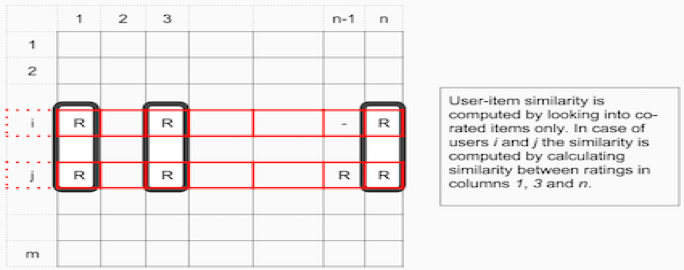 
  <h6 align="center">User-Based Collaborative Filtering</h6> 

 

### Evaluation
We used Root Mean Squared Error (RMSE) for evaluation: 

  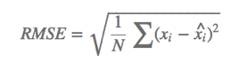 
  <h6 align="center">RMSE Function</h6> 

 

And the evaluation result is:

### DEMO Implement
We used Python Django as backend to implement our project.
1. Environment Setup: -- Windows 10, Python 3.6.4, mysql 5.7.21, mysql bench 6.3 CE
2. Python Requirement Packages: -- numpy, pandas, imdbpie, imdbpy, sklearn
3. App start up by: -- Python manage.py runserver 8080, Open in the browser 127.0.0.1:8080

### Website Preview

  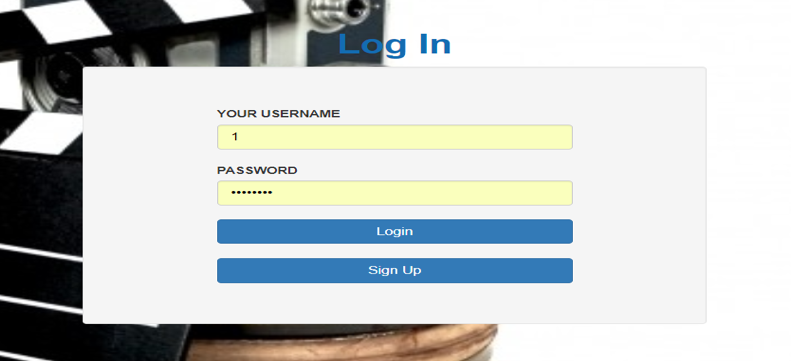 
  <h6 align="center">Login Page</h6> 

 

  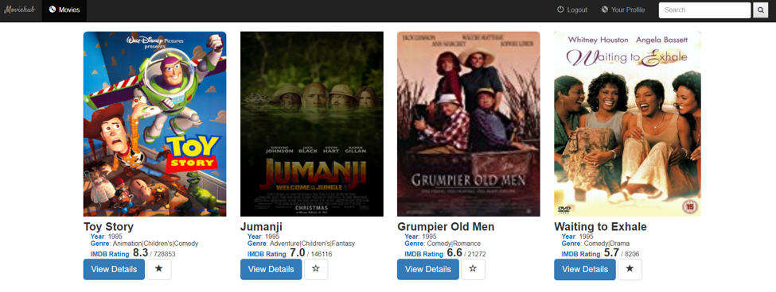 
  <h6 align="center">Home Page</h6> 

 

  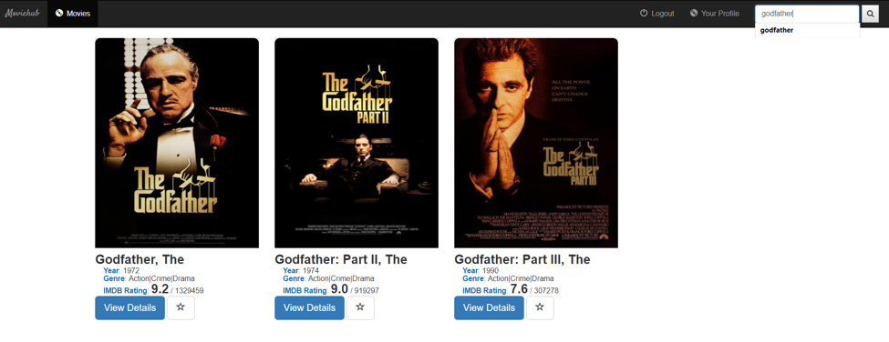 
  <h6 align="center">Search</h6> 

 

  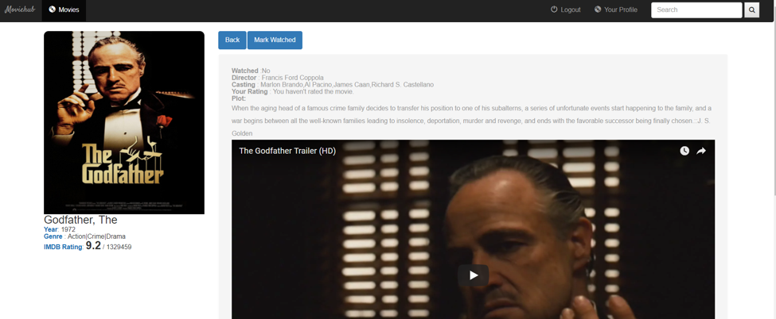 
  <h6 align="center">Movie Detail</h6> 

 

  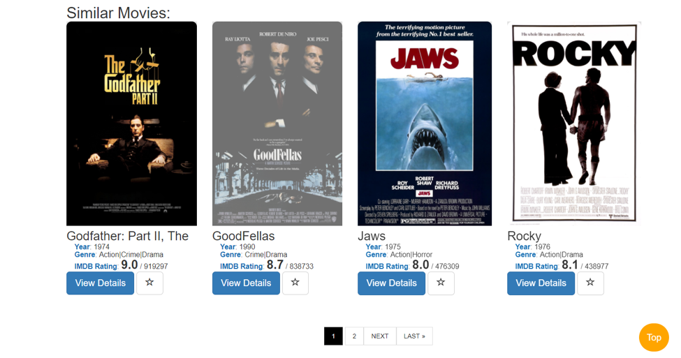 
  <h6 align="center">Movie Recommendation</h6> 

 

  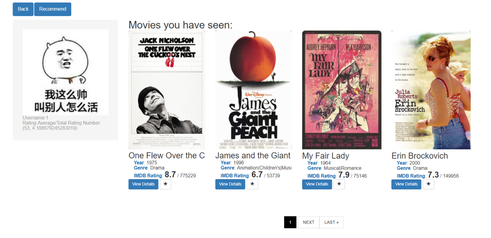 
  <h6 align="center">User Profile</h6> 

 

  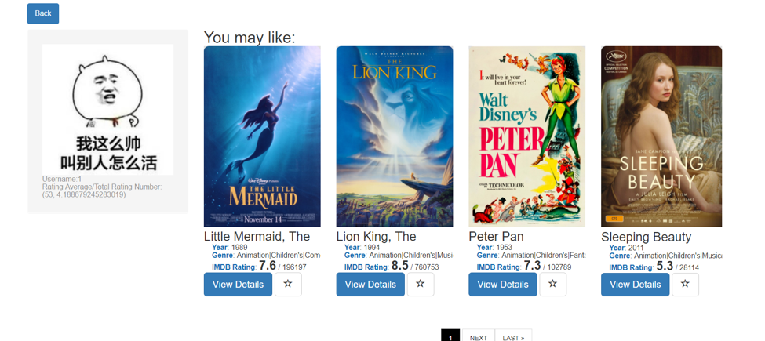 
  <h6 align="center">Recommend Movie for User</h6> 

 
